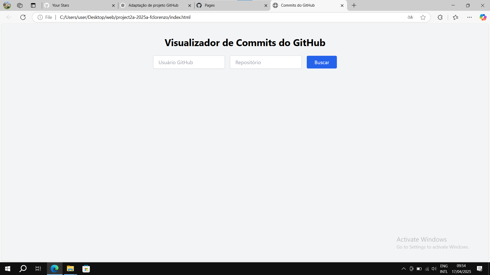

# Projeto2a: GitHub API e DOM Manipulation

## Deploy

<https://elc1090.github.io/project2a-2025a-fclorenzo/>

## Desenvolvedor(a)

Lorenzo Comunello

## Ambiente de desenvolvimento

- VS Code
- Live Server: Extensão do VS Code utilizada para visualizar o projeto em tempo real durante o desenvolvimento.
-Microsoft Edge: para testar o projeto final.
- Git: Para versionamento do código e controle de alterações.

## Créditos

<https://docs.github.com/en/rest/commits/commits?apiVersion=2022-11-28>

## Bastidores

Nunca havia trabalhado em projetos com a api do GitHub antes, mas a documentação é boa e o projeto não é complexo. Foi uma boa experiência.

---
Projeto entregue para a disciplina de [Desenvolvimento de Software para a Web](http://github.com/andreainfufsm/elc1090-2025a) em 2025a
